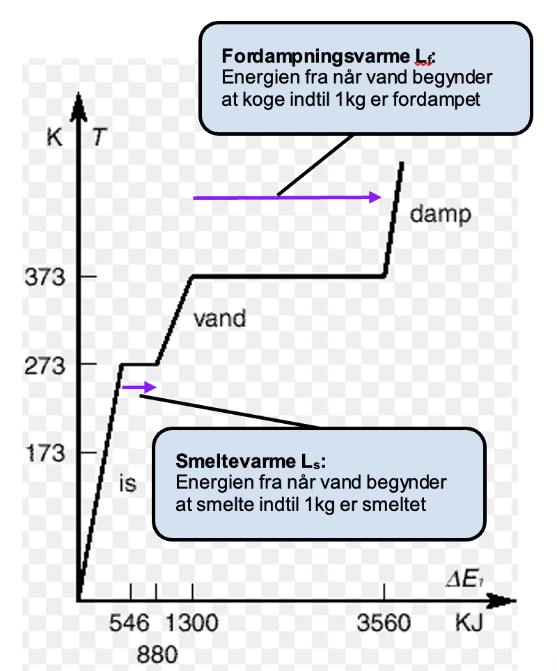
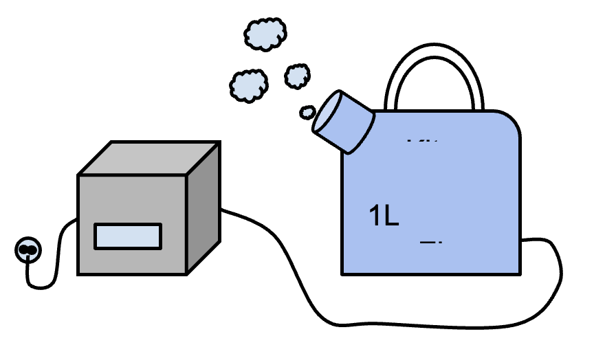

**Niveau:** Fysik C · **Emne:** Energi

---

## Introduktion

Når man tilfører et stof energi, sker der to forskellige ting, afhængigt af hvor
i forløbet man er:

- **Opvarmning:** temperaturen stiger, og energien er $E = m \cdot c \cdot \Delta T$.
- **Faseovergang:** temperaturen står stille, mens stoffet skifter tilstand
  (is → vand, vand → damp). Her bruges energien til at bryde bindinger, ikke til
  at hæve temperaturen.

Figuren nedenfor viser opvarmningen af $1\text{ kg}$ vand fra ca. $0\text{ K}$ op
til ca. $500\text{ K}$. Brug tid i gruppen på at forklare grafen for hinanden:

- Hvad betyder tallene på $y$-aksen og på $x$-aksen?
- Hvorfor står der **is**, **vand** og **damp**?
- Hvad er de lilla pile?
- *(Svært:)* Hvorfor er hældningen forskellig for opvarmning af is, vand og damp?

De to lilla pile er netop **smeltevarmen** $L_s$ og **fordampningsvarmen** $L_f$:
den energi pr. kilogram, der skal til for at gennemføre faseovergangen.

$$E = m \cdot L$$

hvor

- $E$ er den energi, der skal til for faseovergangen, $[\text{J}]$
- $m$ er stoffets masse i kilogram, $[\text{kg}]$
- $L$ er smelte- eller fordampningsvarmen i $\left[\dfrac{\text{J}}{\text{kg}}\right]$

## Variabelkontrol

- **Uafhængig variabel:** den tilførte/afgivne energi i de to forsøg (energimåler ved fordampning; det varme vands afgivne energi ved smeltning).
- **Afhængig variabel:** den mængde vand, der fordamper, henholdsvis den fælles sluttemperatur efter isen er smeltet.
- **Kontrollerede variabler:** vandets masse, isens masse, starttemperaturer, samme elkedel/energimåler og samme opstilling i begge delforsøg.
## Materialer

- vand, både $\text{vand(s)}$ (is) og $\text{vand(l)}$
- energimåler
- elkedel
- termometer

I skal **designe to forsøg** ud fra de samme materialer: ét, der bestemmer
fordampningsvarmen, og ét, der bestemmer smeltevarmen. Lav en forskrivning, hvor
I beskriver, hvordan I vil gøre.

---

## Smeltevarme $L_s$

Idéen er, at varmt vand afgiver energi til at smelte isen, hvorefter det hele
ender på en fælles sluttemperatur. Energibalancen kan skrives som, at energien
afgivet af det varme vand bruges dels på at smelte isen, dels på at varme
smeltevandet op til fællestemperaturen:

$$E_{\text{afgivet-vand}} = E_{\text{smeltning}} + E_{\text{opvarmning af smeltevand}}$$

$$m_{\text{vand}} \cdot c_{\text{vand}} \cdot \Delta T_{\text{vand}} = m_{\text{is}} \cdot L_s + m_{\text{is}} \cdot c_{\text{vand}} \cdot \Delta T_{\text{smeltevand}}$$

Kig på figuren, og prøv at forstå, hvad hvert led går ud på. Lav en tabel i jeres
forskrivning, hvor I måler **alle** de størrelser, den lange formel kræver — sørg
for ikke at glemme noget.

---

## Fordampningsvarme $L_f$

Her skal I bestemme længden af den **lange lilla pil** på grafen længere oppe —
altså energien pr. kilogram til at koge vandet helt væk.

Brug en elkedel tilsluttet en energimåler. Gør jer på forhånd klart, hvad I måler,
og hvordan I måler det. Tænk over, hvordan I adskiller energien til *opvarmning*
fra energien til selve *fordampningen*.

---

## Afrapportering

- Jeres forskrivning med forsøgsdesign og måletabeller for begge forsøg.
- En forklaring af opvarmningsgrafen (faserne, de lilla pile, de forskellige
  hældninger).
- De bestemte værdier for $L_s$ og $L_f$, gerne sammenlignet med tabelværdier.
