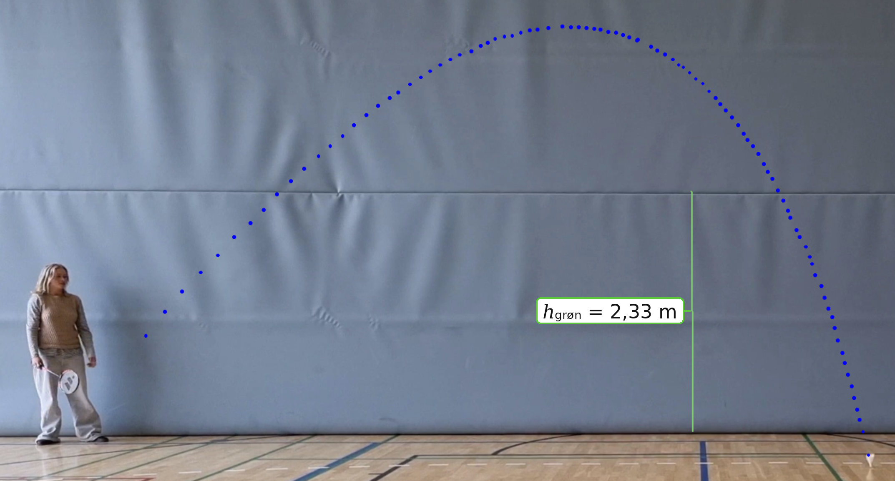

**Niveau: Fysik B** · **Emne: Mekanik – videoanalyse**

[Tilbage til Mekanik]()

Klassen har filmet fald og skud med en tennisbold og en badmintonbold. Hent videoerne, og analysér dem med metoden fra
[Videoanalyse]() i
[Videoanalyseprogrammet]().

## Målestok

Den grønne streg på lærredet er **2,33 m** høj. Brug den til at kalibrere i programmet.

## Videoer

| Video | Bevægelse | Størrelse | Download |
|---|---|---|---|
| Tennis – fald | Tennisbold slippes og falder lodret | 25 MB | <a href="tennis_fald.mp4" download>tennis_fald.mp4</a> |
| Tennis – skud | Tennisbold slås i en bue | 23 MB | <a href="tennis_skud.mp4" download>tennis_skud.mp4</a> |
| Badminton – fald | Badmintonbold slippes og falder lodret | 13 MB | <a href="badminton_fald.mp4" download>badminton_fald.mp4</a> |
| Badminton – skud | Badmintonbold slås i en bue | 13 MB | <a href="badminton_skud.mp4" download>badminton_skud.mp4</a> |

## Det kan du undersøge

1. Lav $y(t)$ for **tennis – fald**, og bestem $g$ med andengradsregression. Se [Stedfunktionen]().
2. Gør det samme for **badminton – fald**. Hvad sker der med hastigheden efter et stykke tid?
3. Sammenlign banerne i de to **skud**. Er de symmetriske om toppunktet? Se på billedet ovenfor.
4. Forklar forskellen med luftmodstand – og vurdér, hvornår parabel-modellen holder.

> **Tjek fps!** Er videoen filmet i slowmotion, skal du skrive den *optagede* framerate i programmet – ellers bliver $g$ alt for lille.
