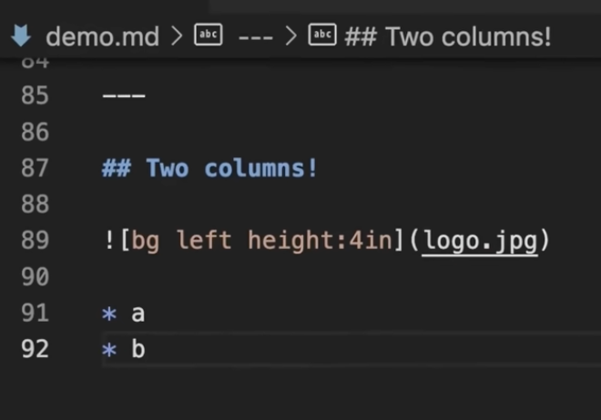

# Hookes lov

---

## Det sker overalt omkring os

- En bil der kører over en bump
- En guitarstreng der svinger
- Dit hjerte der slår
- En bro der vibrerer i vinden
- Et atom der hopper frem og tilbage i et krystal

**Alle sammen** kan beskrives med den samme enkle ligning.

---

## Fjederen — det klassiske eksempel

Et lod hænger i en fjeder.

Du trækker loddet ned og slipper.

Hvad sker der?

> Det svinger op og ned — igen og igen — og langsomt dør det ud.

Spørgsmålet er: **kan vi beskrive det præcist med matematik?**

---

## Kraften er proportional med udsvinget



Fjederen trækker altid loddet *tilbage* mod ligevægt $C$:

$$F = -k \cdot (y - C)$$

- $y - C$ er udsvinget fra ligevægten — ikke fra nul
- Minustegnet betyder "tilbage mod $C$"
- $k$ er fjederkonstanten [N/m]

Det er **Hookes lov**.

---

## Fra kraft til differentialligning

Newtons 2. lov giver:

$$m \cdot \ddot{y} = -k \cdot (y - C)$$

Vi laver et smart **variabelskifte**: sæt $u = y - C$ (mål udsvinget fra ligevægten).

Siden $C$ er en konstant er $\ddot{u} = \ddot{y}$, og ligningen bliver:

$$\ddot{u} = -\frac{k}{m} \cdot u$$

**C er væk!** Vi kalder $\omega^2 = k/m$ og får den enkle form:

$$\boxed{\ddot{u} = -\omega^2 \cdot u}$$

---

## Vi gætter løsningen

Den enkle ligning $\ddot{u} = -\omega^2 u$ har løsningen:

$$u(t) = A \cdot \sin(\omega t + \varphi)$$

Vi skifter tilbage til $y = u + C$:

$$y(t) = A \cdot \sin(\omega t + \varphi) + C$$

**C dukker op igen** — det er bare ligevægtspositionen lagt tilbage på.

Vi sætter det ind og tjekker — og det passer faktisk!

| Parameter | Navn | Styrer |
|---|---|---|
| $A$ | amplitude | hvor stort udsvinget er |
| $\omega$ | vinkelfrekvens | hvor hurtigt det svinger |
| $\varphi$ | fase | startposition |
| $C$ | ligevægt | midterpunktet |

---

## Svingningstiden afhænger ikke af udsvinget

Fra løsningen kan vi læse:

$$T = \frac{2\pi}{\omega} = 2\pi\sqrt{\frac{m}{k}}$$

Det betyder: **det er ligegyldigt hvor langt du trækker loddet ud** — det tager lige lang tid at svinge én tur.

Det er ikke oplagt. Det er faktisk ret mærkeligt. Og det kan I tjekke selv med bevægelsessensoren.

---

## I virkeligheden dør svingningen ud

Den udæmpede model svinger for evigt. Det gør virkeligheden ikke.

Vi bygger dæmpning ind:

$$y(t) = A \cdot e^{-\beta t} \cdot \sin(\omega t + \varphi) + C$$

$e^{-\beta t}$ er en faktor der langsomt skrumper mod nul — den "klemmer" svingningen sammen.

Genkender I matematikken? Det er **præcis** samme form som radioaktivt henfald.

---

## Fra ligning til Python

```python
def svingning(t, A, omega, phi, C):
    return A * np.sin(omega * t + phi) + C
```

I Python kan vi:
- Tegne modellen og lege med parametrene
- Indlæse jeres egne måledata fra bevægelsessensoren
- Lade computeren finde den bedste kombination af parametre

Det kaldes et **fit** — og det er der, fysikken møder data.

---

## Sådan arbejder I med forløbet

Forløbet er delt i **tre dele** på hjemmesiden under *A-Eksp → Hookes lov*:

**Del 1 — Leg med modellen**
Forstå hvad $A$, $\omega$, $\varphi$ og $C$ gør — uden data endnu.
Kør Python-koden og skru på én parameter ad gangen.

**Del 2 — Fit jeres egne data**
I optager en svingning med bevægelsessensoren og fitter modellen til jeres data.

**Del 3 — Dæmpede svingninger**
I bygger $e^{-\beta t}$ ind og fitter hele svingningen — også den del, der dør ud.

---

## Kom i gang

1. Gå ind på siden **Hookes lov 1** under A-Eksp
2. Læs del 1 om position, hastighed og acceleration
3. Kør Python-koden med referencekurven
4. Skru på **én** parameter ad gangen og noter hvad der sker

Spørgsmål undervejs? Ræk hånden op — eller spørg sidemanden først.

**God fornøjelse** 🙂
