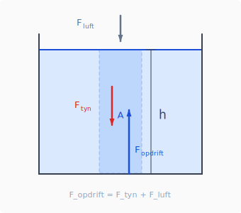
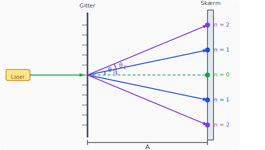

# Startmoduler — 3g

**Modul 1:** Opsamling fra årsprøven
**Modul 2:** Excel-skills

---

# Modul 1 — Opsamling fra årsprøven

Tre udledninger, enheder og fysisk sprog

---

## De tre udledninger

Hvem kan huske dem?

1. Tryk i en væskesøjle
2. Gitterligningen
3. Henfaldsloven og ln(2)

---

## Tryk i en væskesøjle



Vi betragter en søjle af væske med højde $h$ og tværsnitsareal $A$.

Tre kræfter virker på søjlen:
- $F_\text{luft}$ — atmosfærisk tryk ovenfra
- $F_\text{tyn}$ — tyngdekraft på søjlen
- $F_\text{opdrift}$ — tryk fra væsken nedenunder

**Ligevægt:** $F_\text{opdrift} = F_\text{tyn} + F_\text{luft}$

Hvad er trykket $P = F/A$ i bunden?

---

## Løsning — tryk i en væskesøjle

Et vandlag med højde $h$, bredde $A$ og massefylde $\rho$:

$$m = \rho \cdot A \cdot h$$

$$F = m \cdot g = \rho \cdot A \cdot h \cdot g$$

$$P = \frac{F}{A} = \rho \cdot g \cdot h$$

$$\boxed{P = \rho g h}$$

---

## Gitterligningen



En laser sendes gennem et gitter med afstand $d$ mellem stregerne.

På skærmen i afstand $A$ opstår lyse prikker ved bestemte vinkler $\theta$.

**Hvornår er der konstruktiv interferens?**

Hvad er sammenhængen mellem $n$, $\lambda$, $d$ og $\theta$?

---

## Løsning — gitterligningen

Konstruktiv interferens når vejlængdeforskellen er et helt antal bølgelængder:

$$n \cdot \lambda = d \cdot \sin(\theta)$$

- $d$ = afstand mellem streger på gitteret
- $\theta$ = difraktionsvinkel for orden $n$
- $\lambda$ = bølgelængde

---

## Henfaldsloven og ln(2)

To formler I skal kende:

$$N(t) = N_0 \cdot e^{-\lambda t}$$

$$T_{1/2} = \frac{\ln 2}{\lambda}$$

**Opgave:** Hvordan kommer man fra den første til den anden?

---

## Løsning — henfaldsloven og ln(2)

$$N(t) = N_0 \cdot e^{-\lambda t}$$

Halveringstiden $T_{1/2}$: sæt $N = N_0/2$:

$$\frac{1}{2} = e^{-\lambda T_{1/2}}$$

$$\ln\left(\frac{1}{2}\right) = -\lambda T_{1/2}$$

$$\boxed{T_{1/2} = \frac{\ln 2}{\lambda}}$$

---

## Enheder — SI-grundenheder

Kend dem udenad:

| Størrelse | Symbol | SI-enhed |
|---|---|---|
| Længde | $l$ | m |
| Masse | $m$ | kg |
| Tid | $t$ | s |
| Strøm | $I$ | A |
| Temperatur | $T$ | K |
| Stofmængde | $n$ | mol |

---

## Sammensatte enheder — hvad er definitionen?

Skriv definitionen op for **alle tre**:

| Enhed | Navn | Definition |
|---|---|---|
| N | Newton | ? |
| J | Joule | ? |
| V | Volt | ? |
| W | Watt | ? |

> Hint: brug kun kg, m, s og A

---

## Løsning — sammensatte enheder

| Enhed | Navn | Definition |
|---|---|---|
| N | Newton | $\text{kg} \cdot \text{m} \cdot \text{s}^{-2}$ |
| J | Joule | $\text{kg} \cdot \text{m}^2 \cdot \text{s}^{-2}$ |
| V | Volt | $\text{kg} \cdot \text{m}^2 \cdot \text{s}^{-3} \cdot \text{A}^{-1}$ |
| W | Watt | $\text{kg} \cdot \text{m}^2 \cdot \text{s}^{-3}$ |

---

## Fysisk sprog — hvad er rigtigt?

Hvilket udsagn er korrekt fysisk sprog?

**A:** "Kraften er 5 Newton stor"

**B:** "Kraften har størrelsen 5 N"

**C:** "Kraften er på 5 N"

**D:** "Kraften er 5 N"

---

## Løsning — fysisk sprog

✓ **B** og **D** er begge acceptable

✗ **A** — størrelser er ikke "store", de *har* en størrelse

✗ **C** — "på" er hverdagssprog, ikke fysisk sprog

> Fysisk sprog er præcist og entydigt — det samme ord betyder det samme hver gang.

---

## Fysisk sprog — endnu et eksempel

Hvad er galt her?

> *"Temperaturen stiger med 5 grader varmt"*

---

## Løsning

Tre fejl:

1. "grader varmt" — det hedder **kelvin** eller **°C**, ikke "grader varmt"
2. En stigning beskrives med en enhed, ikke et adjektiv
3. Korrekt: *"Temperaturen stiger med 5 K"* eller *"Temperaturen stiger med 5 °C"*

---

# Modul 2 — Excel-skills

Gitterligningen med rigtige data

---

## Gitterligningen i Excel

Et gitter med **600 streger/mm**. I har målt disse vinkler:

| Orden $n$ | Vinkel $\theta$ (°) |
|---|---|
| 1 | 19,3 |
| 2 | 41,3 |
| 3 | 81,9 |

**Opgave:** Find bølgelængden $\lambda$ ved lineær regression i Excel.

*Hint: gitterligningen er $n\lambda = d \cdot \sin\theta$ — hvad er x og y?*

---

## Løsning — opsætning i Excel

Gitterligningen omskrives: $\sin\theta = \frac{\lambda}{d} \cdot n$

Det er en ret linje med:
- **x-akse:** $n$ (orden)
- **y-akse:** $\sin\theta$
- **Hældning:** $a = \lambda / d$
- **$\lambda = a \cdot d$** hvor $d = 1/600\ \text{mm}$

Hældningen er meget lille — ca. 0,33. Merkaten viser muligvis 0,00.

---

## Mærkat-problemet i Excel

Hældningen er fx `0,000550` mm — men merkaten viser `0,00`.

**Fix:** Højreklik på mærkat → *Formatér datamærkat* → øg antal decimaler til 6.

Eller brug formel i en celle:
```
=LINEST(B2:B4; A2:A4)
```

Aflæs hældningen og beregn:
$$\lambda = a \cdot d = a \cdot \frac{1}{600}\ \text{mm}$$

---

## Løsning — facit

$$\lambda = 0{,}330 \cdot \frac{1}{600}\ \text{mm} = 5{,}50 \times 10^{-4}\ \text{mm} = 550\ \text{nm}$$

Det er grønt lys ✓

---

## Dollar-tegn i Excel

Hvornår bruger man `$`?

```
=A2 * B2 / $C$1
```

> `$C$1` er en konstant (fx $d = 1/600$ mm) — den skal ikke rykke når du trækker ned.
> `A2` og `B2` er data — de **skal** rykke.

**Regel:** Sæt `$` foran alt der er en **fast værdi** i dit regneark.

---

## Akser på grafer i Excel

En god graf har **altid**:

1. Titel på begge akser med enhed: *"$\sin\theta$ (dimensionsløs)"*
2. Akserne starter tæt på data — ikke nødvendigvis i (0,0)
3. Mærkat på regressionslinjen med ligning og $R^2$

> $R^2$ tæt på 1 betyder at den lineære model passer godt.

---

# Det var modul 1 og 2

Spørgsmål? Ræk hånden op.

**Næste gang:** vi går i gang med det nye forløb 🙂
