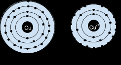
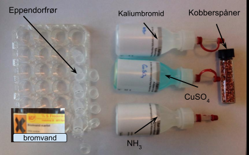

**Niveau:** Kemi C · **Emne:** Atomer, ioner og simpel redox (elektronoverførsel)

---

## Om grundstofferne

### Kobber

Kobber er et rødligt, skinnende metal. Det er grundstof nr. 29 … *(skriv videre)*

> **Opgave:** Forklar forskellen mellem et kobberatom og en kobberion!

### Brom

Brom er et ikke-metal i 7. hovedgruppe og er en … *(skriv videre)*

> **Opgave:** Tegn et dibrommolekyle med det rigtige antal skaller og elektroner.

### Bromid

Bromatomet modtager en elektron …

> **Opgave:** Tegn en bromidion med det rigtige antal skaller og elektroner.

---

## Formål

I dette forsøg vil vi undersøge, hvordan dibrom reagerer med fast kobber.

## Hypotese

Jeg tror, at kobber og dibrom vil reagere med hinanden, og … *(skriv videre her)*

---

## Materialeliste

**Apparatur**

- Eppendorfrør
- Petriskål af plast
- Engangspipetter

**Kemikalier**

- Mættet opløsning af dibrom i vand
- Kobberspåner
- Cu²⁺-opløsning
- Br⁻-opløsning
- Fortyndet ammoniakvand (2 M)
- Sølvnitratopløsning (0,10 M)

> ⚠️ **Sikkerhed:** Opløsningen med dibrom skal behandles **forsigtigt**. Ophældning af dibrom-opløsningen skal foregå i stinkskabet eller under udsug, og eppendorfrøret skal være lukket, når det bæres tilbage på arbejdspladsen.

---

## Reaktionsskema

$$\text{Cu(s)} + \text{Br}_2\text{(aq)} \rightarrow \text{Cu}^{2+}\text{(aq)} + 2\,\text{Br}^-\text{(aq)}$$

Der laves 5 små forsøg. Udfyld skemaet for hvert af forsøgene.

> **Ordforklaring:** Hvad betyder (s), (l), (g) og (aq)?

---

## Forsøgene

### 1) Kobber og dibrom

Bland bromvand og kobberspåner, og ryst. Tag billeder undervejs.

- Skriv dine observationer.
- Lav en tegning og sæt ind.

### 2) Kobbersulfat og ammoniakvand

Bland de to ingredienser og diskutér, hvad resultatet betyder.

$$\text{Cu}^{2+}\text{(aq)} + 4\,\text{NH}_3\text{(aq)} \rightarrow \text{Cu(NH}_3)_4^{2+}\text{(aq)}$$

| Før | Efter |
|-----|-------|
| lyseblå | mørkeblå |

- Lav en tegning og sæt ind.

### 3) Kaliumbromid og sølvnitrat

Gennemfør forsøget, diskutér resultatet, og begrund, hvorfor det giver mening her. Bromidioner danner bundfald med sølvioner.

- Lav en tegning af eppendorfrøret og sæt ind.

### 4) Forsøgsblanding + ammoniakvand

Hvorfor laver vi dette forsøg, og hvilken konklusion kan du drage?

- Lav en tegning og sæt ind.

### 5) Forsøgsblanding + sølvioner

Hvorfor laver vi dette forsøg, og hvilken konklusion kan du drage?

- Lav en tegning og sæt ind.

---

## Konklusion

Skriv en samlet konklusion her i hele sætninger.
