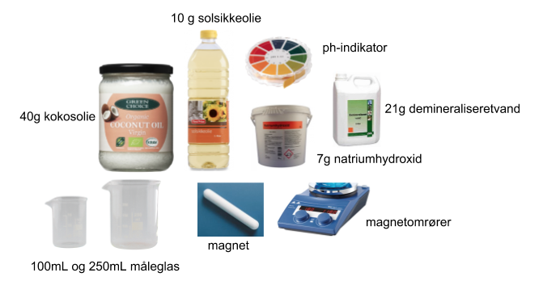

**Niveau:** Kemi C · **Emne:** Organisk kemi — estere, forsæbning, hydrofil/hydrofob

## Førskrivning

1. Forklar, hvordan en sæbe virker. Brug begreberne **hydrofil**, **hydrofob**, **elektronegativitet** og **sæbeion**. Lav en tegning, hvor du viser noget fedt eller olie, du skal fjerne fra en overflade. Tegn sæbeionerne som små haletusser, hvor hovedet er negativ ladet og hydrofil og halen er lang og hydrofob.
2. I forsøget skal du fremstille en sæbe af kokosfedt eller palmin og tidselolie og NaOH (natriumhydroxid), som er en stærk base. Find strukturformlerne for triglyceriderne kokosfedt og tidselolie på nettet. Beskriv formlerne, og beskriv forskellene.
3. Find ud af, hvad en "forsæbningsreaktion" er, og hvordan den fungerer.
4. Find ud af, hvorfor det er smart at putte alkohol i.

## Materialer og kemikalier

- 250 mL højt bægerglas (så det ikke sprøjter), 2 mindre bægerglas (100 mL), termometer, varmeplade, stor magnet
- NaOH(s), kokosfedt, solsikkeolie, demineraliseret vand, ethanol (husholdningssprit 93 %), duftstoffer, frugtfarve, indikatorpapir

## Fremgangsmåde

> ⚠️ **Sikkerhed:** Kittel og briller er absolut nødvendigt!!!!

1. Afvej 40 g kokosfedt og 10 g solsikkeolie i et rengjort 250 mL bægerglas, og smelt det forsigtigt på en varmeplade. Kom en stor magnet i. Når fedtstofferne er delvist smeltede, skrues der ned for varmepladen, så temperaturen under omrøringen af sæben er ca. 40 °C.
2. Afvej 21 g vand i et 100 mL bægerglas. Tag beskyttelseshandsker på, og afvej 7 g NaOH. Natriumhydroxiden drysses forsigtigt ned i vandet, mens bægerglasset holdes i bevægelse. Der udvikles varme ved reaktionen, og efter et minuts tid er perlerne opløst.
3. Når alt NaOH er opløst, tilsættes ca 7 g ethanol (husholdningssprit).
4. Hæld NaOH-opløsningen i glasset med de opløste fedtstoffer. Rør rundt med svag varme, indtil pH-værdien er på 10 eller derunder, og sæben har cremet konsistens. Det tager ca. ¾ time. Jo længere tid sæben kan røres, desto mildere bliver den.
5. Tilsæt farve og duft efter behag.
6. Hæld sæben op i små forme, og lad dem stå i 2–3 dage. Derefter poppes de ud af formene. Sæben lægges til modning og tørring i 2–6 uger.

> **Måling:** Gør lidt af sæben fugtig, og mål sæbens pH-værdi. pH-værdien af den færdige sæbe skal helst ligge under 9,5.
