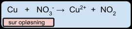
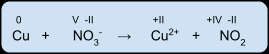
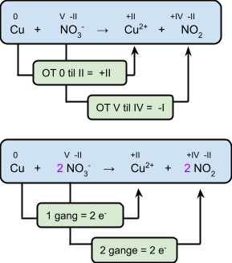
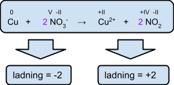
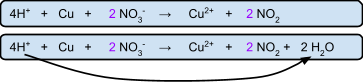
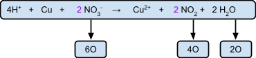

## Afstemning af redoxreaktioner

**1: Opskriv det ikke afstemte reaktionsskema.**

**2: Opskriv alle oxidationstal.**

**3: Bestem koefficienterne, sådan at den samlede stigning i oxidationstal matches det samlede fald.**

Her kan man se, at Cu(s) som fast stof har oxidationstal 0, og kobber-ionen Cu^2+^ har oxidationstal +II. To elektroner flyttes derfor væk fra kobber.

Disse to elektroner skal optages af det andet stof, som her er nitrogen i nitrat. N ændrer dermed sit oxidationstrin og går fra V til IV.

**4: Afstem ionladningerne på højre og venstre side.**

Dertil skal du tælle ladningerne på venstre og på højre side.

**5: Reaktionen foregår i syre, dvs. at H^+^-ioner indgår i reaktionen.** Tilføj nu det passende antal hydroner på venstre side af reaktionspilen (eller hydroxidioner OH^-^, hvis reaktionen foregår i basisk opløsning).

Tæl nu hydroner på venstre side, og tilføj det samme antal hydroner på højre side i form af vandmolekyler. Her bliver 4H^+^ til 2H~2~O.

**6: Check nu, at antal hydrogenatomer er det samme på venstre og højre side.** Antal oxygenatomer skal nu også være ens på venstre og højre side af reaktionspilen.

---

## Opgaver

**I sur opløsning:**

- Mg + NO~3~^-^ → Mg^2+^ + NO~2~
- MnO~4~^-^ + Sn^2+^ → Mn^2+^ + Sn^4+^
- Mn^2+^ + PbO~2~ → MnO~4~^-^ + Pb^2+^
- Cr~2~O~7~^2-^ + I^-^ → Cr^3+^ + I~2~
- Zn + NO~3~^-^ → Zn^2+^ + NH~4~^+^
- Fe^2+^ + MnO~4~^-^ → Fe^3+^ + Mn^2+^
- CH~3~OH + Cr~2~O~7~^2-^ → HCHO + Cr^3+^

**I basisk opløsning:**

- Al + NO~3~^-^ → Al(OH)~2~O^-^ + NO
- S^2-^ + ClO~3~^-^ → Cl^-^ + S
- ClO^-^ + S~2~O~3~^2-^ → Cl^-^ + SO~4~^2-^

**Titreringsopgave**

25,0 mL jern(II)opløsning forbruger ved titrering 16,5 mL 0,0200 M KMnO~4~. Beregn koncentrationen af Fe^2+^ i jern(II)opløsningen.
