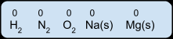
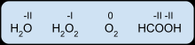
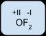
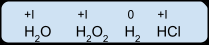
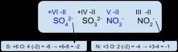
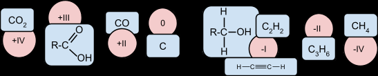

## Oxidationstal (and where to find them)

Oxidationstal tildeles enkelt atomer. Atomer som ædelgasser vil stå alene, men de fleste atomer vil være bundet i enten metal-, ion- eller elektronparbindinger.

Generelt kan man sige, at elektronen tildeles det atom i en binding, som har størst **E**lektro**N**egativitetsværdi (EN).

Her er et par regler:

Oxidationstal skrives med **romertal**, og de går fra -8 til +8[^1]:

| ‑VIII | ‑VII | ‑VI | ‑V | ‑IV | ‑III | ‑II | ‑I | 0 | +I | +II | +III | +IV | +V | +VI | +VII | +VIII |
|---|---|---|---|---|---|---|---|---|---|---|---|---|---|---|---|---|

### Regel 1 (Grundstoffer: ox = 0)

Grundstoffer består af de samme atomer. Derfor er ox-tal i grundstoffernes atomer altid **ox = 0**.

### Regel 2 (oxygen har for det meste ox = -II)

Oxygen er meget elektronegativt (EN = 3,5), derfor vil det stort set altid have **ox = -II**.

Er oxygen bundet til sig selv som i O~2~, gælder grundstofreglen (ox = 0). Er kun én af bindingerne en O-O-binding, som i hydrogenperoxid H-O-O-H, er ox-tallet på oxygen ox = -I.

Kun i bindinger med fluor kan oxygen have ox > 0:

### Regel 3 (Hydrogen har som regel ox = +I)

Hydrogen har i kemiske forbindelser ox = +I, med mindre det er H~2~, hvor ox = 0.

### Regel 4 (molekyle og ioner: samlet ox = ladning)

For et molekyle eller en ionforbindelse gælder det, at summen af de deltagende atomers oxidationstal er lig med ladningen.

### Regel 5

Carbon har EN = 2,5 og hydrogen EN = 2,1, dvs. at carbon i forbindelser med H får tildelt oxidationstal -1, og i forbindelse med O oxidationstal +1. Det resulterer i, at C kan have mange forskellige oxidationstal i de kendte carbonforbindelser.

---

## Opgaver

**Opgave 1**

Find oxidationstal i følgende nitrogenforbindelser, og stil dem op i rækkefølge fra ox = +V til ox = -III:

N~2~O, $\text{NO}_{3}^{-}$, NO, NO~2~, NH~3~, N~2~, N~2~O~5~, HNO~3~, $\text{NO}_{2}^{-}$, N~2~O~4~, N~2~H~4~

**Opgave 2**

Find oxidationstal i følgende svovlforbindelser, og stil dem op i rækkefølge fra ox = +VI til ox = -II:

H~2~S, $\text{HS}^{-}$, H~2~SO~4~, $\text{S}_{2}\text{O}_{3}^{2-}$, H~2~SO~3~, $\text{S}^{2-}$, SO~3~, S(s), $\text{SO}_{3}^{2-}$, $\text{S}_{4}\text{O}_{6}^{2-}$ (svær), SO~2~, $\text{SO}_{4}^{2-}$

**Opgave 3**

Find oxidationstal i alle atomer i følgende molekyler/ioner:

Carbonat, hydrogencarbonat, dihydrogencarbonat, natriumsulfat, aluminiumphosphat, calciumphosphat, carbondioxid, hydrogenperoxid, dihydrogenoxid, magnesiumchlorid

**Opgave 4**

Mangan er et meget brugt stof, når man laver forsøg med oxidationstal. Gå på nettet, og find nogle af de mest almindelige forbindelser, som mangan indgår i, og skriv dem op med oxidationstal.

[^1]: I nogle tilfælde kan oxidationstal være brøker, så skriver man dem som brøker med almindelige tal.
