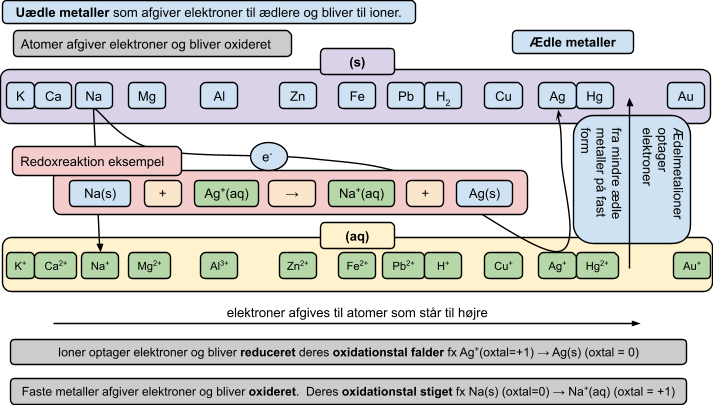

## Spændingsrækken

## Opgave 1

Find ud af, om stofferne reagerer med hinanden, og hvis ja, så skriv produkterne. Skriv **ox** og **red** under de stoffer, som bliver henholdsvis oxideret og reduceret.

- $\text{Hg}^{2+}$(aq) + Zn(s) →
- $\text{Ca}^{2+}$(aq) + Au(s) →
- $\text{Mg}^{2+}$(aq) + Zn(s) →
- $\text{Zn}^{2+}$(aq) + Mg(s) →
- $\text{Al}^{3+}$(aq) + Mg(s) →
- $\text{Fe}^{2+}$(aq) + Cu(s) →
- $\text{Fe}^{2+}$(aq) + Mg(s) →

## Opgave 2

Opskriv:

a. 2 reaktioner hvor Al(s) indgår
b. 2 reaktioner hvor $\text{Al}^{3+}$(aq) indgår
c. 4 reaktioner hvor $\text{H}^{+}$(aq) indgår
d. 2 reaktioner hvor H~2~(g) indgår

## Opgave 3

Sæt oxidationstal over alle ioner og atomer, som indgår i opgave 1 og 2.

## Opgave 4

Vælg 4 af reaktionerne fra opgave 1, og skriv dem op som delreaktioner og samlet reaktion, fx:

$$\text{Ca}^{2+}\text{(aq)} + 2e^- \rightarrow \text{Ca(s)}$$
$$2\text{K(s)} \rightarrow 2\text{K}^+\text{(aq)} + 2e^-$$

$$\text{Ca}^{2+}\text{(aq)} + 2\text{K(s)} + 2e^- \rightarrow \text{Ca(s)} + 2\text{K}^+\text{(aq)} + 2e^-$$
$$\text{Ca}^{2+}\text{(aq)} + 2\text{K(s)} \rightarrow \text{Ca(s)} + 2\text{K}^+\text{(aq)}$$

## Opgave 5

Hvad sker der i de følgende blandinger?

1. En opløsning af zinksulfat, i hvilken du smider nogle stykker fast kobber
2. En opløsning af kobbersulfat, i hvilken du smider nogle stykker fast zink
3. Saltsyre blandet med kobbersulfat
4. Saltsyre blandet med fast kobber
5. Saltsyre blandet med fast jern
6. Saltsyre blandet med jern(II)sulfat

---

### Eksempel: delreaktionerne for Mg(s) + $\text{H}^{+}$(aq)

$$\text{Mg(s)} \rightarrow \text{Mg}^{2+}\text{(aq)} + 2e^-$$
$$2\text{H}^+\text{(aq)} + 2e^- \rightarrow \text{H}_2\text{(g)}$$
$$\text{Mg(s)} + 2\text{H}^+\text{(aq)} + 2e^- \rightarrow \text{Mg}^{2+}\text{(aq)} + 2e^- + \text{H}_2\text{(g)}$$
$$\text{Mg(s)} + 2\text{H}^+\text{(aq)} \rightarrow \text{Mg}^{2+}\text{(aq)} + \text{H}_2\text{(g)}$$

---

## Eksperiment

**Formål:** at finde ud af, hvilke metaller der reagerer med syren HCl.

**Udstyr og kemikalier:**

- Brøndplade
- Metaller på fast form: Mg(s), Fe(s), Cu(s), Zn(s), Al(s)
- 2 M HCl
- Ionforbindelser: FeSO~4~, CuSO~4~, Al(NO~3~)~3~, MgCl~2~, ZnSO~4~

**Udførelse:**

Put metallerne i brøndpladen, og lad dem reagere med saltsyre. Læg mærke til:

- om de reagerer
- hvor stærkt de reagerer

Prøv nu at lade metallerne reagere med ionforbindelserne, fx fast Zn(s) med FeSO~4~.
