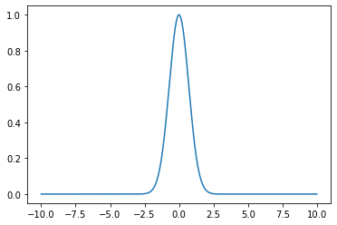
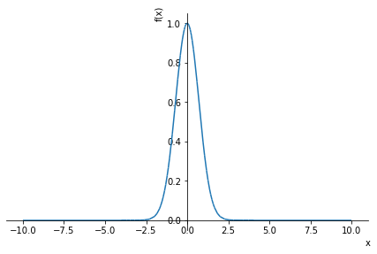

# Integraler med scipy og sympy
Denne side handler om integration og er lavet i Jupyter notebook. Er man interesseret i markdown features med Jupyter [klik her](https://towardsdatascience.com/write-markdown-latex-in-the-jupyter-notebook-10985edb91fdhttps://towardsdatascience.com/write-markdown-latex-in-the-jupyter-notebook-10985edb91fd). 


**Scipy** løser integralet numerisk. Scipy er god til at finde talværdien af et integral og direkte gemme det som en variable til at regne videre med. 

$$\int_0^4 \frac{1}{4}\cdot x^{3} dx = 16$$

**Sympy** skal tænkes mere som *maple* og løser integralet analytisk. Dvs at man med sympy kan finde den matematiske formel fx. 

$$ y' = \frac{1}{4}\cdot x^{3}  \rightarrow y = \frac{1}{16} \cdot  x^{4}$$ 

## Definition af funktionen
I både scipy og sympy skal skal man definere funktionen først. Det kan gøres på forskellige måde. 
Kun med **sympy** kan man taste funktionen direkte i python udtrykket for integralberegningen. Med **scipy** skal man definere funktionen først. 
## For både scipy og sympy gælder at 
1. importer scipy eller sympy med ```import scipy as sc ``` eller ```from sympy import * ``` 
2. definere funktionen, enten direkte med **def** eller med **lambda** funktionen
3. kalde integralfunktionen og beregne integralet 

## Integrationskommandoer for **scipy**
- **quad**          Almindelig integration 
```python
integrate.quad(x2,0,4) #hvor x2 er en defineret funktion
```
- **dblquad**       Dobbeltintegral
- **tplquad**       Tripelintegral
```python
#Ved dobbelt og tripel integraler skal funktionen og grænserne defineres. 
```
[Her er der et link til syntaksen til dobbelt og tripelintegraler](https://docs.scipy.org/doc/scipy/reference/tutorial/integrate.html)

### Kommandoen med brugen af lambda funktionen ser ud som følende
Vi vil løse integralet:

$$ f(x) = \frac{1}{4}x^3$$

i grænserne 0 til 4. 

I modsætning til sympy kan man i scipy **ikke** direkte skrive funktionen ind i ```integrate ``` kommandoen. Men man SKAL definere det fx med **lambda** funktionen:


```python
from scipy import integrate
x2 = lambda x: 1/4*x**3
integrate.quad(x2, 0, 4)
```


    (16.0, 1.7763568394002505e-13)


## Scipy med **def** til at definere funktionen
**lambda** funktionen er en shotcut men er man god til at bruge **def** er mere *pure python*


```python
from scipy import integrate
import numpy as np
def minfunktion(x):
    return 1/4*x**3

I = integrate.quad(minfunktion,0,4)
I[0]
```


    16.0


Hvis man vil regne videre med resultatet skal man definere en variabel som indeholder integralet og dens usikkerhed. Variablen "resultat" er af typen "Double" dvs de enkelte elementer kan kaldes med 
```python
minI = resultat[0]
minI_usikkerhed = resultat[1]
```


```python
resultat = integrate.quad(x2, 0, 4)
minI = resultat[0]
minI
```


    16.0


## Regne med scipy resultater
Scipy angiver resultatet som en *double* variable. Altså en liste med to elementer (Værdien og usikkerheden) 

Integralværdien kan gemmes som variabel ved at kalde den med [0] fra integrationen. 


```python
x4 = lambda x: -x**2+4
x5 = lambda x: x**2-4
minIx4 = integrate.quad(x4,-2,2)[0]
minIx5 = integrate.quad(x5,-2,2)[0]
minIx4-minIx5
```


    21.333333333333336


## Opgave
Løs integralet 

\begin{align}
f(x) = e^{-x^2}
\end{align}

fra - uendelig til uendelig
## Uendelig og eksponentialfunktionen
I sympy kan man bruge symbolet -oo og oo men scipy har ikke sådan en definition. Vi bruger numpy
**np.inf**


```python
import numpy as np
x3 = lambda x: np.exp(-x**2)
integrate.quad(x3,-np.inf,np.inf)[0]
```


    1.7724538509055159


Læg mærke til at det er $$\sqrt \pi $$


```python
(integrate.quad(x3,-np.inf,np.inf)[0])**2
```


    3.1415926535897927


#### Et hurtigt python plot giver lidt indsigt i funktionsforløbet
For flere plotfeatures med python [klik her](https://sites.google.com/view/natvid/python/plot-en-graf?authuser=0https://sites.google.com/view/natvid/python/plot-en-graf?authuser=0)


```python
import matplotlib.pyplot as plt
x = np.linspace(-10,10,1000)
y = np.exp(-x**2)
plt.plot(x,y)
```


    [<matplotlib.lines.Line2D at 0x7f931cfa2160>]


    

    


#### Et plot med sympy genereres sådan her


```python
from sympy import *
x = symbols('x')
plot(exp(-x**2))
```


    

    


    <sympy.plotting.plot.Plot at 0x7f931cfc8460>


## En gang til **uden** lambda funktionen
På mange måder en mere intuitiv måde at gøre det her på især når man ved hvordan man definerer funktioner


```python
from scipy import integrate
import numpy as np
def minfunktion(x):
    return np.exp(-x**2)

I = integrate.quad(minfunktion,-np.inf, np.inf)
I[0]
```


    1.7724538509055159


Bruger man **def** har man flere muligheder for at styre funktionen. Den kan fx. udvides på en dejlig måde med argumenter (her **a** og **b**. Læg mærke til at de skal *kaldes* med **args=(a,b)** i scipy funktionen **integrate.quad**


```python
from scipy import integrate
import numpy as np
def minfunktion(x, a, b):
    return a*np.exp(-x**2) + b

a = 4
b = 2
I = integrate.quad(minfunktion,-10, 10, args=(a,b))
I[0]
```


    47.089815403622055


## Integraler med sympy
Som sagt arbejder sympy på en helt anden måde. Sympy løser integralerne analystisk. 
Det er klart bedst at arbejde med **sympy** i **sympy - mode only** og ikke blande det sammen med scipy som er mere plain python. 

Du skal, som udgangspunkt, hellere ikke bruge sympy i større python programmer, med mindre du virkelig ved hvad du gør. 

Sympy er logisk i sigselv og kræver at man tænker på en anden måde end *python-scipy-matplotlib-numpy* universet. 

Sympy kan, som sagt, sammenlignes mere med programmer som **Maple**, **Maxima**, **Mathematica**, **Matcad** og **matlab** end med python.

### Forskel på `integrate` og `Integral`
#### `integrate`

Vil du **beregne** en integralværdi brug `integrate`. Denne funktion kan også snilt klares med scipy. 

$$ f(x) = \int_{0}^{4}x^3-4x^2+10x-3dx$$


```python
from sympy import *
x = symbols('x')
integrate(x**3-4*x**2+10*x-3,x)
```


$\displaystyle \frac{x^{4}}{4} - \frac{4 x^{3}}{3} + 5 x^{2} - 3 x$


```python
integrate((x**3-4*x**2+10*x-3),(x,0,4))
```


$\displaystyle \frac{140}{3}$


```python
integrate((x**3-4*x**2+10*x-3),(x,0,4)).evalf()
```


$\displaystyle 46.6666666666667$


Lægt mærke til følgende 


```python
t = symbols('t')
integrate((x**3-4*x**2+10*x-3),(x,0,t))
```


$\displaystyle \frac{t^{4}}{4} - \frac{4 t^{3}}{3} + 5 t^{2} - 3 t$


### `Integral`
Vil du lave en symbols integration så brug `Integral`

Denne form for symbolsk integration kan kun **sympy** klare. 


```python
from sympy import *
x = symbols('x')
Integral((x**3-4*x**2+10*x-3),(x,0,4))
```


$\displaystyle \int\limits_{0}^{4} \left(x^{3} - 4 x^{2} + 10 x - 3\right)\, dx$


Tilføje `evalf()` i enden resulterer i en numerisk værdi lige som med `integrate`


```python
Integral((x**3-4*x**2+10*x-3),(x,0,4)).evalf()
```


$\displaystyle 46.6666666666667$


## Eksempler på integrationer med **sympy**


```python
from sympy import *
x = symbols('x')
integrate(ln(x))
```


$\displaystyle x \log{\left(x \right)} - x$


```python
integrate(4*x**3)
```


$\displaystyle x^{4}$


```python
integrate(sin(x))
```


$\displaystyle - \cos{\left(x \right)}$


```python
integrate(cos(2*x)*sin(2*x)/(tan(x)))
```


$\displaystyle \frac{x}{2} + \sin{\left(x \right)} \cos^{3}{\left(x \right)} + \frac{\sin{\left(x \right)} \cos{\left(x \right)}}{2}$


```python
integrate(cos(2*x)*sin(2*x)/(tan(x)),(x,0,pi))
```


$\displaystyle \frac{\pi}{2}$


```python
integrate(cos(2*x)*sin(2*x)/(tan(x)),(x,0,pi)).evalf()
```


$\displaystyle 1.5707963267949$


## Integration af rotationslegemer
Volumen af et rotationslegeme berenges ved følgende formel:
$$V = \pi \cdot \int_a^b \left(f(x)\right)^2 dx$$

### Lineær funktion med både sympy og scipy
Læg mærke til at du kan kalde integralværdien som variabel direkte i scipy med 

$$ f(x) = \frac{1}{2} x$$
I grænserne 0 til 10. 

```python
I = sc.integrate.quad(minfunktion,g1,g2)[0]
```

Det kan man også med sympy ved at tilordne integralet en værdi. 
```python
Isympy = integrate(pi*(0.5*x)**2,(x,g1,g2)).evalf()
```
 
## Først med sympy


```python
from sympy import *
x = symbols('x')

g1 = 0
g2 = 10

integrate(pi*(0.5*x)**2,(x,g1,g2)).evalf()
```


$\displaystyle 261.799387799149$


```python
Isympy = integrate(pi*(0.5*x)**2,(x,g1,g2)).evalf()
print(Isympy) #Nu kan variablen Isympy bruges til at regne med integralværdien
```

    261.799387799149


## Med scipy


```python
import scipy as sc
def minfunktion(x):
    return sc.pi*(0.5*x)**2
g1 = 0
g2 = 10
Iscipy=sc.integrate.quad(minfunktion,g1,g2)[0]
print(Iscipy)
```

    261.79938779914943


## Flere eksempler


```python
from sympy import *
x,y = symbols('x y')
integrate(x**2 + y**2,(x))
```


$\displaystyle \frac{x^{3}}{3} + x y^{2}$


```python

```
